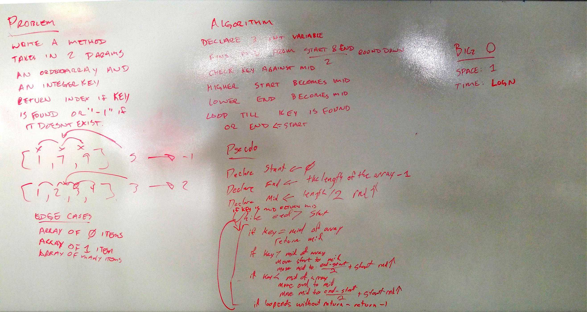

# ***Data Structure Implementation README Example***
------------------------------

# Linked List
#### *Author: Severus Snape*

------------------------------

## Description

A C# implementation of a 

------------------------------

## Methods

| Method | Summary | Big O Time | Big O Space | Example | 
| :----------- | :----------- | :-------------: | :-------------: | :----------- |
| Binary Search | Searches an array through the use of binary search to find a key | O(LogN) | O(1) | BinarySearch(6) |

------------------------------

## Visuals

### Whiteboard of Challenge 03 - Array Binary Search

------------------------------

## Change Log
1.0: Initial build.
------------------------------

For more information on Markdown: https://www.markdownguide.org/cheat-sheet