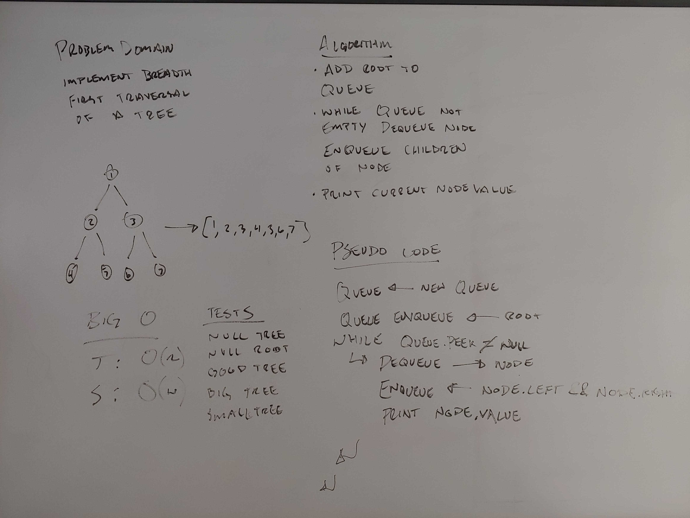

# Breadth-first
Breadth First is the act of traversing the nodes of a tree layer by layer starting from the top and working down the tree doing all children of the previous tier before moving to the next tier.

## Challenge
Implement a breadth first traversal

## Approach & Efficiency
I used a Queue to implement breadth first traversal. This is O(n) for time as it visits each node in the entire execution of the method, and O(w) space where w is the width of the tree. This is because the maximum number of nodes in the queue at one time is the width of the tree.

## Solution
