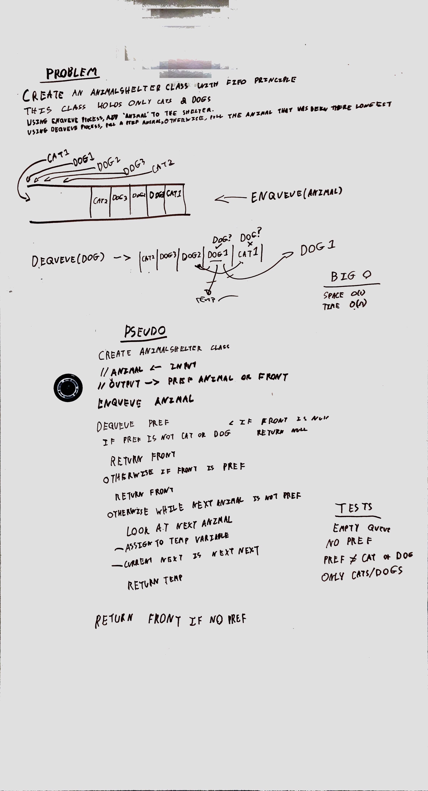

# Animal Shelter

### Approach

The Animal Shelter uses 2 Queues, one for Dogs and the other for Cats. Cats and Dogs have a Timestamp associated with them. If the person wants a Dog it dequeues from Dogs, if they want a Cat it dequeues from Cats. With no preference it compares the timestamps of the first Dog and Cat and takes the first.

### Efficiency

The solution I built is O(1) Time and for Enqueue and Dequeue
and O(1) for Dequeue space but O(n) for Enqueue space

### Solution

