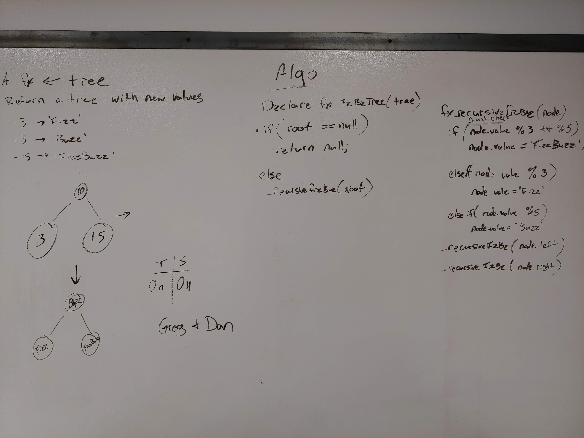

# FizzBuzz Tree
The method contained in this solution takes in a binary tree of objects and changes node values that meet the rules of FizzBuzz accordingly. The rules of FizzBuzz are that any number divisible by 3 becomes Fizz, any number divisible by 5 becomes Buzz and any word divisible by both becomes FizzBuzz.

## Challenge
Implement a method to do FizzBuzz on a tree of integers

## Approach & Efficiency
Breadth First traversal with comparisons. The Big O for the solution is O(n) for time and O(n) for space because it looks at each individual node in the tree and makes a queue node for holding them.

## Solution

