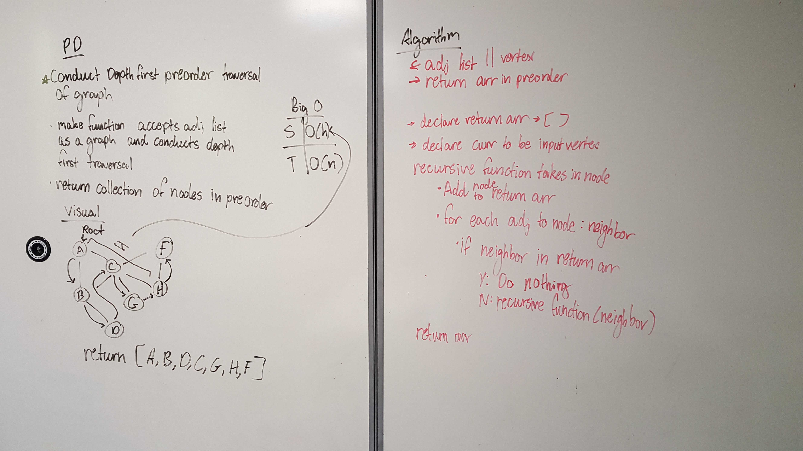

# Graph
#### *Author: Daniel Logerstedt*

------------------------------

## Description
This is a C# implementation of a graph. It contains methods to add nodes and edges as well as get nodes and edges and the size of the graph.

------------------------------

## Methods

| Method | Summary | Big O Time | Big O Space | Example | 
| :----------- | :----------- | :-------------: | :-------------: | :----------- |
| Add Vertex | Adds a new vertex node to the graph | O(1) | O(n) | Graph.AddVertex(99) |
| Add Edge | Adds an edge between two vertices in the graph | O(1) | O(n) | Graph.AddEdge(VertexFrom, VertexTo, 10) |
| Get Vertices | Retrieves a list of vertex nodes in the graph | O(1) | O(1) | Graph.GetVertices() |
| Get Edges | Gets the adjacency list for a specific vertex node | O(1) | O(1) | Graph.GetEdges(Vertex) |
| Get Size | Gets the graph size | O(1) | O(1) | Graph.GetSize() |

## Challenge 38

------------------------------

## Change Log
***[The change log will list any changes made to the code base. This includes any changes from TA/Instructor feedback]***
1.3: *Added new passing tests for Contains method* - 17 Nov 2012
1.2: *Fixed bug where Next relation was being lost on Insert* - 14 Nov 2012
1.1: *Fixed formatting for the Print method* - 13 Nov 2012

------------------------------

For more information on Markdown: https://www.markdownguide.org/cheat-sheet