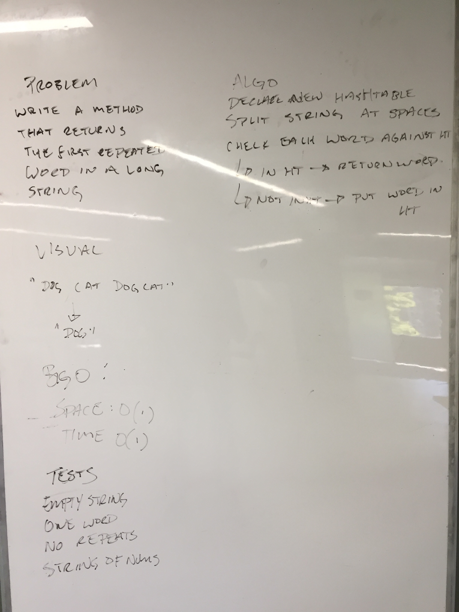
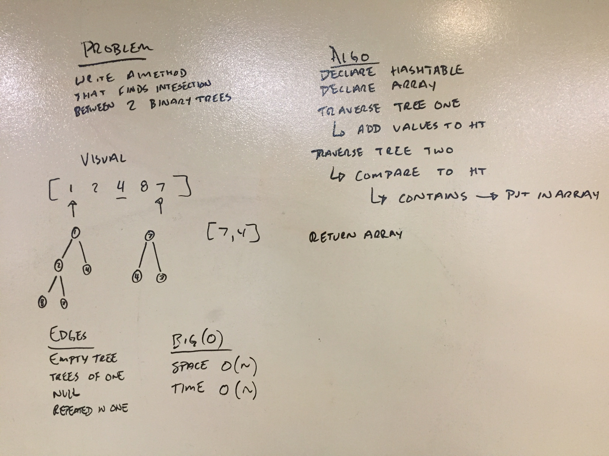

# HashTable
A HashTable is a data structure that contains data in key value pairs. This allows adding and lookup of items contained within it to be constant

The HashTable is built ontop of an Array that contains the data. The index data is stored in is determined by the Hash used which converts the key provided into a number value within the Array.

## Challenge
Implement a Hashtable class in C#, It should contain 4 instance methods: Add, Get, Contains, and Hash.

Add should add an item to the HashTable

Get should retrieve and item from the HashTable

Contains should return a boolean value of whether an item is in the HashTable

Hash should take a key and return an int based on that key

#### Challenge 31

Implement a method that returns the first repeated word in a string.

#### Challenge 32

Implement a method that compares two trees and returns a set of shared values.

## Approach & Efficiency

| Method | Summary | Big O Time | Big O Space | Example | 
| :----------- | :----------- | :-------------: | :-------------: | :----------- |
| Add | Inserts a key value pair into the HashTable | O(1) | O(1) | HashTable.Add("key", "value") |
| Get | Retrieves a value from the HashTable | O(1) | O(1) | HashTable.Get("key") |
| Contains | Checks if a key is in the HashTable | O(1) | O(1) | HashTable.Contains("key") |
| Hash | Finds the int value associated with a key | O(1) | O(1) | HashTable.Hash("key") |
| Repeated Word | Takes in a string and returns the first repeated word. | O(log n) | O(1) | RepeatedWord("words list of words") |
| Tree Intersection | Takes in two binary trees and finds common values | O(n) | O(n) | TreeIntersection(treeOne, treeTwo) |

## API

Add takes in a key and value. It then hashes the key and places both the key and value inside an Entry object at the hashed location in the table.

Get takes in a key. It then hashes the key and returns the Entry that matches that key located at the hashed location.

Contains takes in a key. It then hashes the key and checks whether an Entry with that key exists in the hashed location.

Hash takes in a key. It then creates an int value based on the provided key and returns it.

Repeated Word takes in a string and breaks the string apart looking through the words to return the first repeated word.

Tree Intersection takes in two binary trees and iterates over them returning the shared values between both trees.

## Files

[Table Code](./Hashtable/Classes/Table.cs)
[Entry Code](./Hashtable/Classes/Entry.cs)

[Tests](./HashtableTests/UnitTest1.cs)

## Solution Images

#### Challenge 31

#### Challenge 32

