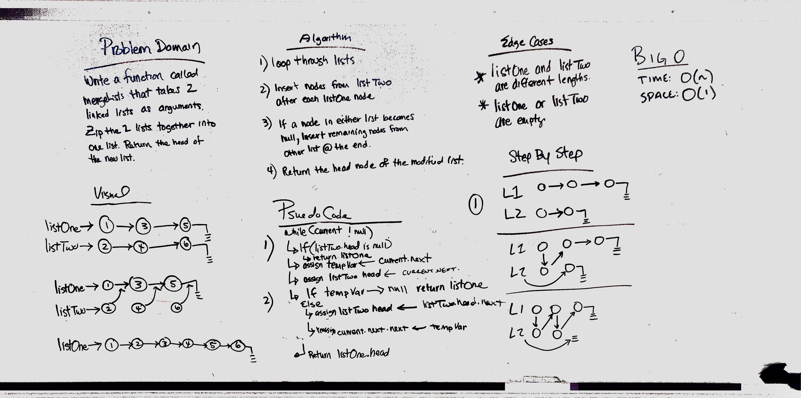

# Merge two Linked Lists
This method takes in two linked lists and returns the head of both of them merged into one.

## Challenge
Write a method that takes in two linked lists and returns one list containing both lists zipper merged together.

## Approach & Efficiency
The approach I used is to juggle the nodes and place them in the correct order inside the first list while removing them from the second list. This leads to a zippered list located in the reference location of the first list and an empty list where the second was. This is an O(1) space solution because it creates no new nodes and only uses the Nodes already present.

## Solution

