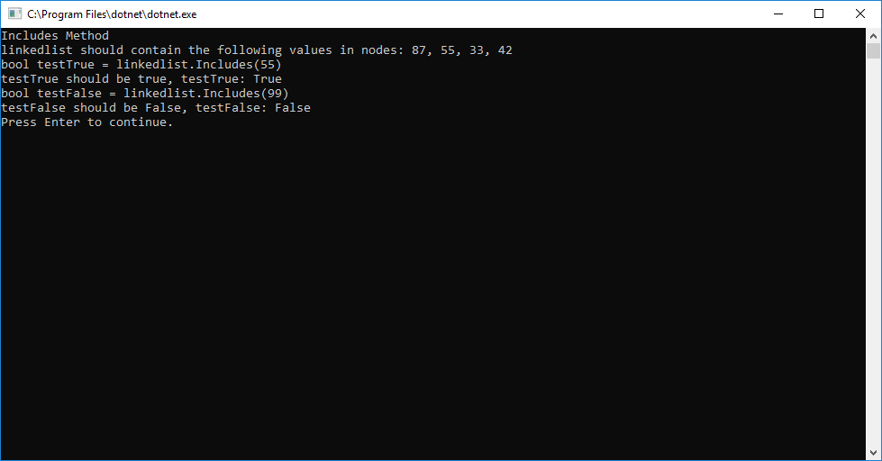

# Linked List
#### *Author: Daniel Logerstedt*

------------------------------

## Description

This is a C# implementation of a linked list. It instantiates the linked list initially with a null head. The class also has instance methods to insert a head at the beginning of the list, find if a value is present in the list, print the list to an array format, and get the length of the list.

------------------------------

## Methods

| Method | Summary | Big O Time | Big O Space | Example | 
| :----------- | :----------- | :-------------: | :-------------: | :----------- |
| Insert | Adds a new `Node` to the `Linked List` | O(1) | O(1) | myList.Insert(99) |
| Append | Adds a new `Node` at the end of the `Linked List` | O(n) | O(1) | myList.Append(99) |
| InsertBefore | Adds a new `Node` into the `Linked List` before the first `Node` containing a given value | O(n) | O(1) | myList.InsertBefore(99) |
| InsertAfter | Adds a new `Node` into the `Linked List` after the first `Node` containing a given value | O(n) | O(1) | myList.InsertAfter(99) |
| KthFromEnd | Locates and returns the node that is k distance from the end of the `LinkedList` | O(n) | O(1) | myList.KthFromEnd(2) |
| Includes | Takes in a value and returns a boolean if the value is in the `LinkedList` | O(n) | O(1) | myList.Includes(99) |
| Length | Iterates over the list and returns an integer value for the length | O(n) | O(1) | myList.Length() |
| Print | Prints the `Linked List` to the console | O(n) | O(n) | myList.Print() |

------------------------------

## Visuals

##### Insert Method
Insert first creates a new node using the value provided and the current head, it then replaces the current head with this new node. By doing this it causes the previous head to be the second node and the new node to take the place as the head.

##### Append Method
Append first iterates to the end of the Linked List, then creates a new node containing the given value and places it at the end.

##### InsertBefore Method
InsertBefore first checks to see if the head is null, if so it Inserts a node at the head containing the value. It then checks to see if the node to place before is Included in the list, if not it places a new node at the end of the list with the value. Once it has determined the node is present it iterates to that node keeping track of the previous node as it does and places a node between the previous and node to place before.

##### InsertAfter Method
InsertAfter first checks to see if the head is null, if so it Inserts a node at the head containing the value. It then checks to see if the node to place before is Included in the list, if not it places a new node at the end of the list with the value. Once it has determined the node is present it iterates to that node and places the new node after it.

##### KthFromEnd Method
Locates and returns the Kth node from the end, if it exists. In situations where the node doesn't exist it returns null.

##### Includes Method
Includes first checks if the head is null and returns false if it is. After checking if head is null it looks at the first node for the value and then proceeds to iterate over the list and if it ever finds the value in the list it returns true. Returns false if it makes it to the end of the list without finding the value.

##### Length Method
Length first checks if head is null, if so it returns 0. If the head is not null it iterates over the list and keeps count of the Nodes then returns the length.

##### Print Method
Print first calls the Length method to get the length, it then makes an array of that size and iterates over the list adding each value into the array before returning the array.

------------------------------

## Solution Images (Challenges)

##### Challenge 06

##### Challenge 07

------------------------------

## Change Log
1.1: Added Append, InsertBefore, and InsertAfter methods as part of Code Challenge 06
1.2: Added KthFromEnd method as part of Code Challenge 07