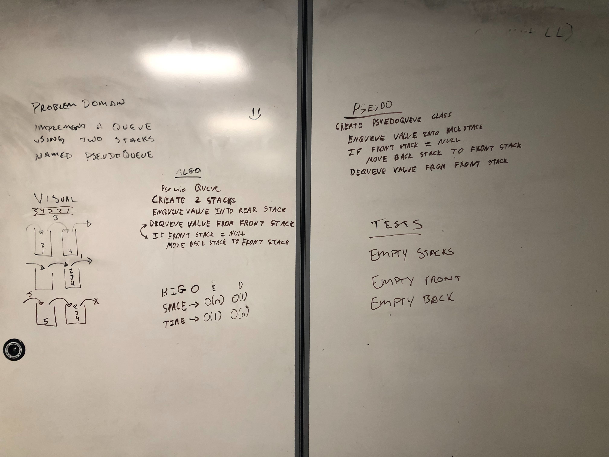

## PseudoQueue

The Queue implementation that I built is O(1) for Enqueue in Time, and O(n) worst case for Dequeue and Peek. This is because it uses 2 Stacks, in the worst case if all the Nodes are located in the Back Stack it must first Cycle all of them to the front.
The Queue is O(1) Space for Peek and Dequeue, and O(n) space for Enqueue.

 ## API

 ##### Queue

 Enqueue: Takes in a value of the type in the Queue and places it in the Back Stack of the Queue.
Usage: `queue.Enqueue("Data")`

 Dequeue: If needed it moves all of the Back Stack to the Front Stack (if the Front is empty) before removing the Front Node and returning it.
Usage: `queue.Dequeue()`

 Peek: If needed it moves all of the Back Stack to the Front Stack (if the Front is empty) before returning the Front Node without removing it.
Usage: `queue.Peek()`

## Solution

